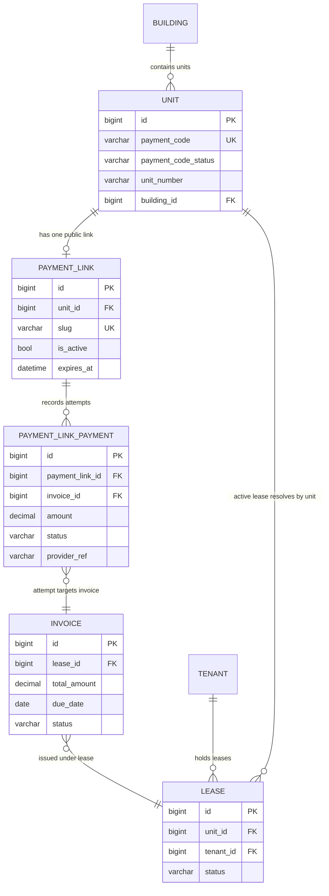

# RentSlab Payment Codes ERD

## Behavior Notes

- `Unit.payment_code` is stable and permanent for the unit.
- Payment link visibility is controlled by `PaymentLink.is_active` and optional `expires_at`.
- Public payment attempts are captured as `PaymentLinkPayment` with lifecycle:
  `created -> processing -> confirmed | failed | refunded`.
